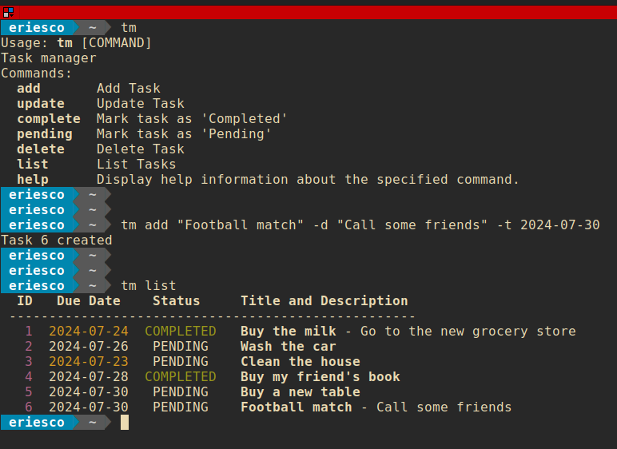

# Task Manager

Simple task manager.

Allows to add, update and delete tasks. Every task can have a _title, description, due date_ and _status_.

Tasks are stored in a JSON file named `.tm` in user's `home` directory.

The Task Manager executable file is located in `./target/tm`.    

As this file is created using GraalVM SDK, it is not necessary a local Java SDK install to execute it.
Just execute it or add it to the local `PATH` variable or, even better, move it to a directory wich is already in
the `PATH` like `/usr/local/bin/`





## Usage

```
Usage: tm [COMMAND]
Task manager
Commands:
  add       Add Task
  update    Update Task
  complete  Mark task as 'Completed'
  pending   Mark task as 'Pending'
  delete    Delete Task
  list      List Tasks
  help      Display help information about the specified command.
```


## Develop

### Create an executable file

Create a native executable file with GraalVM is a time-consuming process.   
For fast feedback during development is easier to create an executable file which depends on the local installed JDK.

`mvn package appassembler:assemble`

This new executable file will be located in `./target/appassembler/bin/tm`


### Create a native executable file

A native executable file located in `./target/tm` is distributed with the code and ready to use.

Recreate this file needs some **requirements**:

First, **Install GraalVM** with [SDKMAN](https://sdkman.io/) or directly
from [GraalVM web](https://www.graalvm.org/latest/docs/getting-started):

```
sudo mkdir /usr/local/java
cd /usr/local/java
sudo wget https://download.oracle.com/graalvm/22/latest/graalvm-jdk-22_linux-x64_bin.tar.gz
sudo tar zxvf graalvm-jdk-22_linux-x64_bin.tar.gz
sudo rm graalvm-jdk-22_linux-x64_bin.tar.gz
sudo update-alternatives --install "/usr/bin/java" "java" "/usr/local/java/graalvm-jdk-22.0.2+9.1/bin/java" 1
sudo update-alternatives --config java  # Choose GraalVM
export PATH=/usr/local/java/graalvm-jdk-22.0.2+9.1/bin:$PATH  # Put this line in ~/.bashrc
source ~/.bashrc
java -version
native-image --version
```

The `native-image` tool, from GraalVM, depends on the local toolchain. To install it:

- Linux: `sudo apt install build-essential zlib1g-dev`
- MacOS: `xcode-select --install`
- Windows: Install Visual Studio 2022 version 17.6.0 or later, and Microsoft Visual C++ (MSVC).

Compile the project and **build a native executable file** at one step:  
`mvn -Pnative package`

The native executable, named `tm`, is created in the `target/` directory of the project.
To run the executable:`./target/tm`


### Bash autocompletion

To enable Bash autocompletion for the new `tm` executable:

```
sudo apt install bash-completion
sudo cp tm-bash-completion.sh /etc/bash_completion.d/tm
source /etc/bash_completion
```

